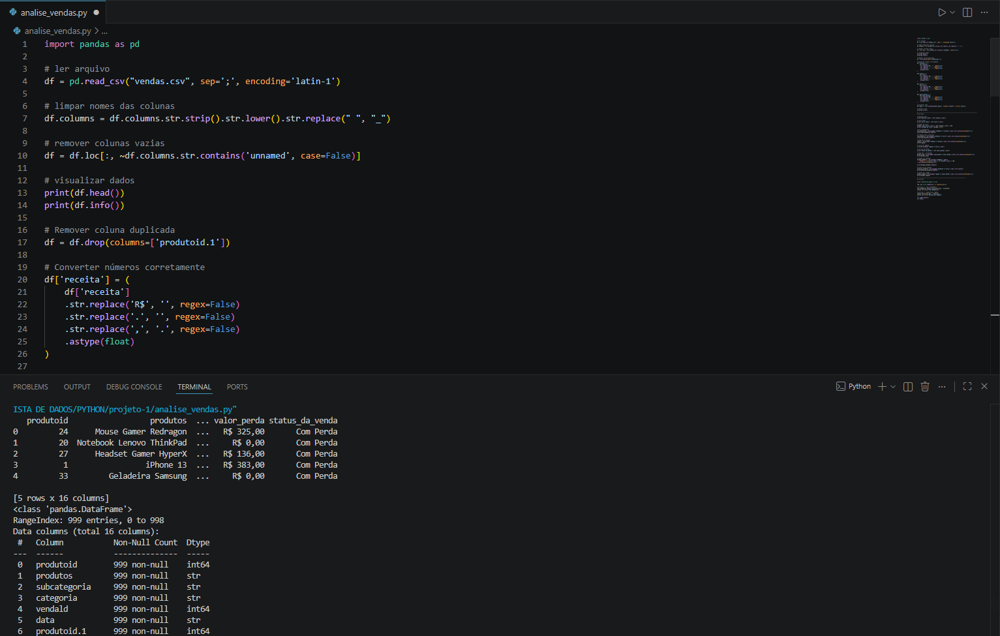
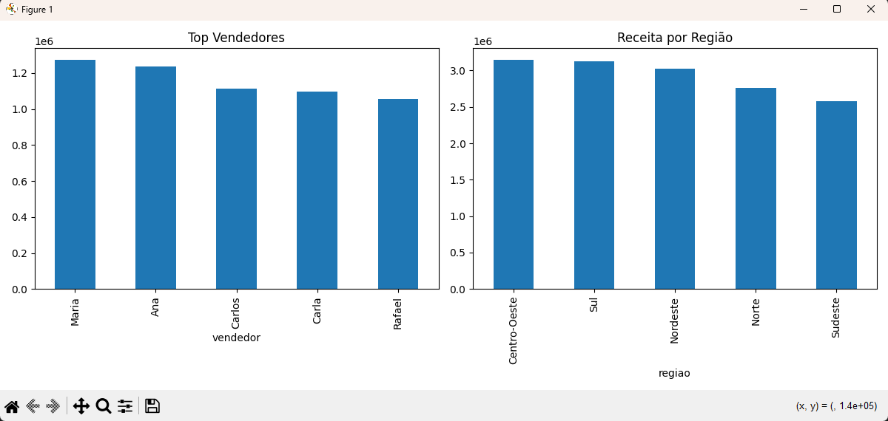

# 📊 Análise de Vendas com Python

## 🧠 Contexto de Negócio

Uma empresa do setor de vendas enfrenta desafios para entender melhor seu desempenho comercial, principalmente em relação a:

* Quais vendedores geram mais receita
* Quais produtos são mais lucrativos
* Onde estão ocorrendo perdas financeiras
* Como melhorar a margem de lucro

Diante disso, este projeto foi desenvolvido com o objetivo de transformar dados brutos em insights estratégicos para apoiar a tomada de decisão.

---

## 🎯 Objetivo

Realizar uma análise exploratória de dados (EDA) para identificar padrões, oportunidades e problemas que impactam diretamente os resultados financeiros da empresa.

---

## 🛠️ Ferramentas Utilizadas

* Python
* pandas
* matplotlib

---

## 📂 Base de Dados

O dataset contém informações de vendas, incluindo:

* Produtos e categorias
* Quantidade vendida
* Receita, custo e lucro
* Região e vendedor
* Tipos de perda e valor de perda
* Status da venda

---

## 🧹 Tratamento de Dados

Foram realizadas as seguintes etapas:

* Padronização dos nomes das colunas
* Remoção de colunas inválidas ou duplicadas
* Conversão de valores monetários (R$) para formato numérico
* Tratamento de datas
* Correção de inconsistências nos dados

---

## 📊 Análises Realizadas

* Receita total e lucro total
* Margem de lucro
* Ranking dos vendedores por receita
* Produtos mais lucrativos e menos rentáveis
* Análise de perdas financeiras
* Receita por região

---

## 💡 Principais Insights

* A receita está concentrada em poucos vendedores, indicando dependência comercial
* Alguns produtos apresentam prejuízo, sugerindo necessidade de revisão de preços ou custos
* As perdas estão concentradas em regiões específicas, indicando possíveis falhas operacionais
* Nem todos os vendedores com alta receita possuem boa margem, indicando ineficiência em algumas vendas

---

## 📈 Visualizações

* Gráfico de Top 5 Vendedores por Receita
* Gráfico de Receita por Região

---

## 🚀 Conclusão

A análise demonstrou que a empresa possui oportunidades claras de melhoria:

* Reduzir dependência de poucos vendedores
* Revisar produtos com baixa lucratividade
* Controlar perdas operacionais
* Otimizar estratégias comerciais por região

Com base nesses insights, a empresa pode tomar decisões mais estratégicas e orientadas por dados, aumentando sua eficiência e resultados financeiros.

---
